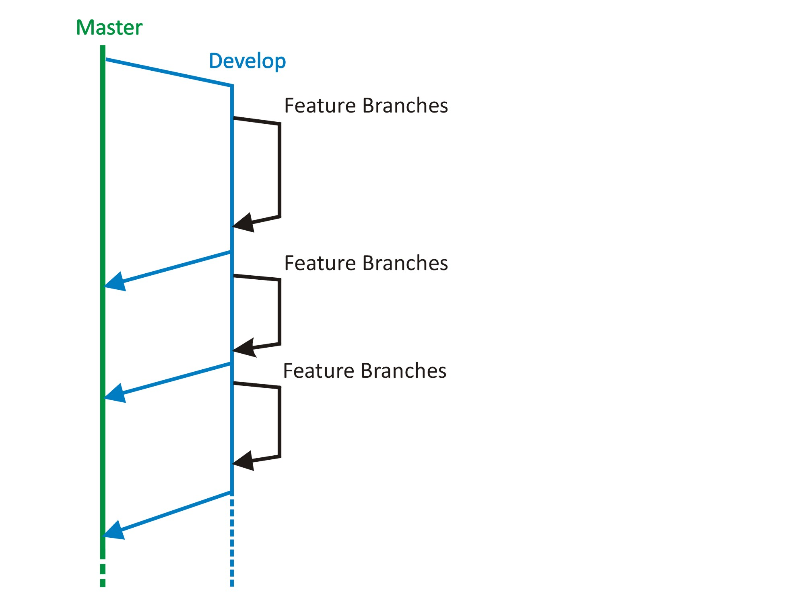

## Coding Challenge: NYC Schools

This repository contains a detailed sample app that implements using Java, Kotlin, MVVM architecture (ViewModel, LiveData, ViewBinding, Navigation Component), Dagger2, Kotlin Coroutines, Retrofit, OkHttp3.

  
  

# Architecture Blueprint

  
   

  
# Dagger Dependency Graph

  
   

# Dagger Dependency Graph with Scope

  
   

# Github branches

  
   

### The app has following packages:
1. **di**: It contains the Dagger (dependency injection) related packages, like component, sub component, module and scope.
2. **model**: It contains all the data accessing and manipulating components.
3. **network**: Contains Api urls, network exception, custom response object and status of request.
4. **repository**: Repository is bridge between viewmodel and data. It is responsible for get accessing data from internet using network package.
5. **ui**: It contains Activities, Fragments and adapter.
6. **utils**: It contains utility classes like itemClickListener
7. **viewmodel**: MainViewModel, a bridge between view and repository.

### Library reference resources:
1. Dagger: https://developer.android.com/training/dependency-injection/dagger-android
2. Navigation Component: https://developer.android.com/guide/navigation/navigation-getting-started
3. DataBinding: https://developer.android.com/topic/libraries/data-binding
4. ViewBinding: https://developer.android.com/topic/libraries/view-binding
5. Kotlin Coroutine: https://kotlinlang.org/docs/coroutines-basics.html#coroutines-are-light-weight
6. Retrofit: https://github.com/square/retrofit
7. OkHttp3 (Logging Interceptor): https://github.com/square/okhttp
8. OkHttp3 (Network Connection Interceptor): https://medium.com/programming-lite/retrofit-2-handling-network-error-defc7d373ad1
  
### Testing Libraries
  1. JUnit 4: https://github.com/junit-team/junit4
  2. Mokito: https://github.com/mockito/mockito
